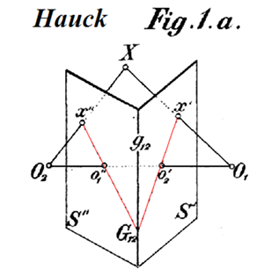

# Overview 

This repository is a set of utilities and examples for the *Visió per Computador* subject of the *Master of Intelligent Systems* of the [UIB](https://www.uib.cat). 

## Install

We can install this repository with or without conda.

The first step is to download the repository
```
     git clone https://github.com/miquelmn/visio_per_computador.git
```
**Without conda**
```
     pip install -r requirements.txt
```
**With conda**
```
    conda env create --file eviroment.yml
```

## Content


### Homographies

 A simple example of homographies. We select four points of two images to make an homography and warp one image to the plane of the other. The points are selected with a GUI based on ``matplotlib``.
<br/>
<br/>
<br/>
<br/>
<br/>
<br/>
<br/>

### Descriptors
+ ``scan_document.py``. Converts a deformed photo of a document into a perfect scan 
 
